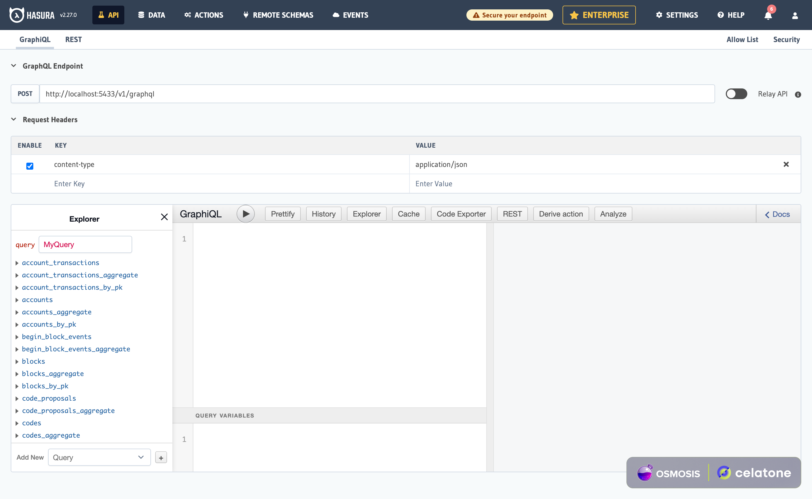
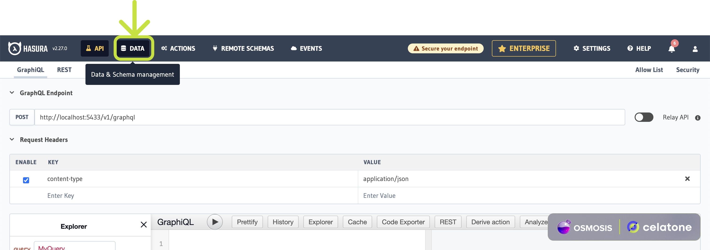
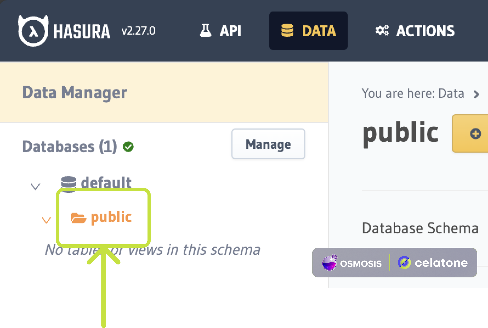
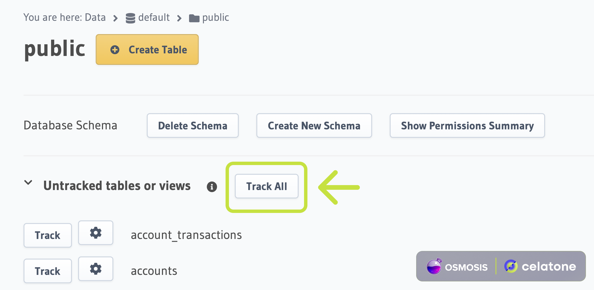
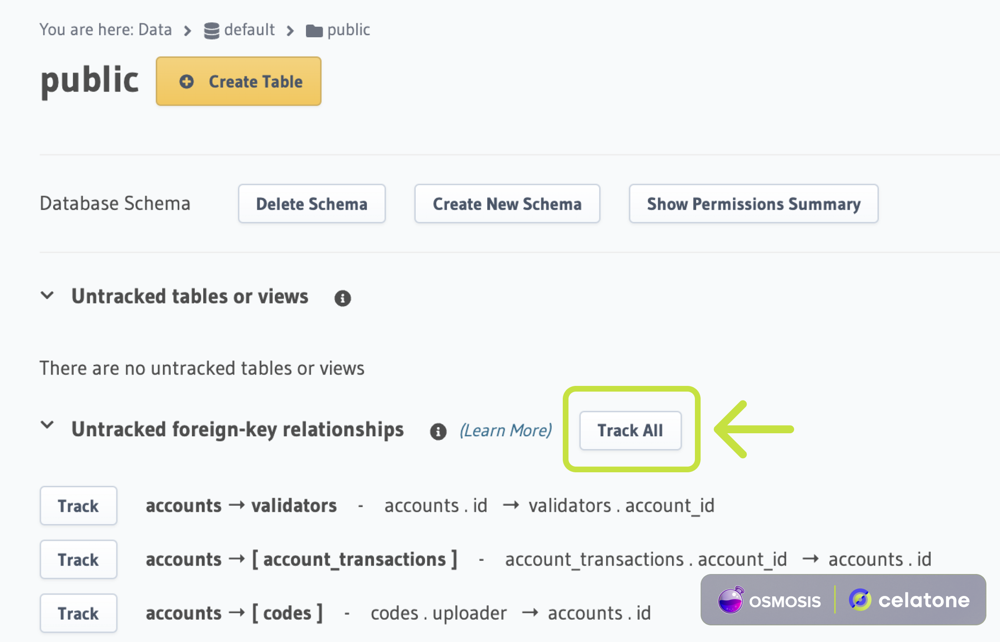
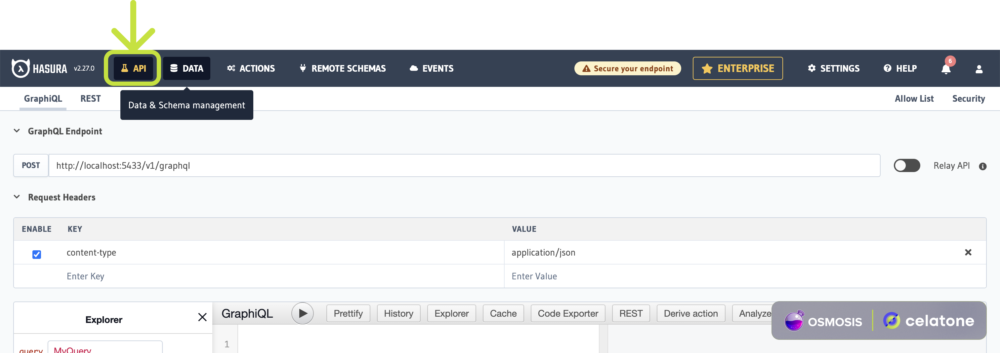
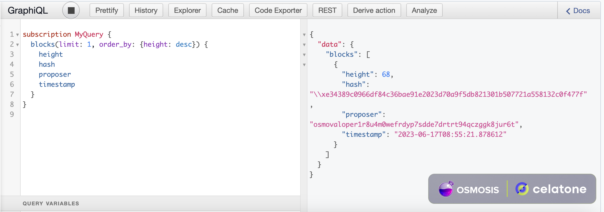

# Celatone Osmosis Indexer Node


[](https://t.me/celatone_announcements)

[Osmosis](https://www.github.com/osmosis-labs/osmosis) indexer node implementation for Celatone, an open-source 
explorer and CosmWasm development tool. 

## Documentation

For the most up-to-date Celatone documentation, please visit
[docs.celat.one](https://docs.celat.one/) and the Osmosis documentation at
[docs.osmosis.zone](https://docs.osmosis.zone/)

The following sections below will guide anyone interested in running their own indexer and deploy a local version of 
Celatone on their machine.

## Indexing the LocalOsmosis network

### Prerequisite

The Celatone indexer node comes with a [celatone-docker](../celatone-docker) directory which enables fast and
easy deployment.

For Ubuntu users, install docker via this script
```shell
cd && mkdir docker && cd docker
curl -fsSL https://get.docker.com -o get-docker.sh
sudo sh get-docker.sh
```

For macOS users, you can easily install Docker Desktop 
via [this link](https://docs.docker.com/desktop/install/mac-install/).

### Starting the service

To start the service, simply run the following command 
(Ubuntu users might need to add `sudo` at the beginning of the command if there is a permission denied error)

```shell
cd <REPO_NAME>
docker compose up -d --build
```

Please note that **flusher-daemon** error while starting the docker-compose service is expected.

This command will launch the services specified in the [docker-compose](../docker-compose.yml) file, 
which include:

- **indexer_node** for indexing LocalOsmosis
- **postgres** for storing indexed data
- **faucet** an optional service for requesting additional tokens
- **graphql-engine** for hosting the Hasura GraphQL engine and server
- **zookeeper** provides an in-sync view of Kafka cluster, topics and messages
- **kafka** acts as a message queue for the indexer node
- **flusher-init** runs a single command to create required tables and views in the Postgres database
- **flusher-daemon** processes messages from Kafka and flushes them into the database
- **proxy-ssl-server** hosts a reverse proxy server for the node RPC, LCD and the Hasura server. All components are required to connect with [celatone-frontend](https://www.github.com/alleslabs/celatone-frontend)

### Tracking the database

Now that all docker-compose services are up and well alive,
database tracking is still required to allow data querying via Hasura GraphQL.

1.Go to Hasura Console by visiting [this link](http://localhost/hasura). The webpage should look something like this.



2.Click on the `DATA` button at the top of the page.



3.The available schemas will be shown at the top left of the page. Select the `default` database and the `public` schema.



4.Click on `Track All` to track all tables and views available. A confirmation prompt may appear, select `Ok` to confirm.



5.The page will reload with all tables tracked. Click `Track All` again, but this time for all foreign-key relationships.



6.Finally, we can go back to the `API` page and try some example queries.
Using the subscription script below, new block should come up in realtime.



```graphql
subscription LatestBlock {
    blocks(limit: 1, order_by: {height: desc}) {
        height
        hash
        proposer
        timestamp
    }
}
```



## Further Customization

Completing the steps above would get vanilla LocalOsmosis indexer up and running.
However, for anyone looking to customize the chain itself and add more indexer support, 
the following sections below outline the essential components and actions needed to customize Celatone indexer.

## Core Components

### Hooks

Celatone indexer hooks basically process events occurring in the chain and flush them into the message queue. 
This implementation modifies the original Osmosis implementation by adding our own hooks and adapters.
A hook is a customizable interface that can be processed along with the ABCI application of the Osmosis app, while an 
adapter is a component inside the hook that defines how each hook-supported module should behave in the ABCI process.
Usually, the scope of each adapter is defined by keepers required to complete the tasks.

You can find the implementation of Hooks and Adapters implementation in the [hooks](../hooks) directory.

To use hooks and adapters in the Osmosis app, we need to modify the [app.go](../app/app.go) file. 
Start by adding the hooks to the OsmosisApp struct itself and initialize a new hook into the app hooks. 
Then, specify when to call the hook functions in the ABCI lifecycle according to the
hook interface, as seen in the `BeginBlocker`, `EndBlocker`, `Commit`, `InitChainer` and `DeliverTx` functions of the 
OsmosisApp.

### Flusher

The Flusher is a simple Python service that consumes messages from a message queue 
and loads them into the Postgres database. 
The schema for the database is also specified in the [db.py](../flusher/flusher/db.py). 
Any changes to the existing database schema, whether it is additional tables or relationships, need to be specified
in this file.

Message consuming is implemented in the [sync.py](../flusher/flusher/sync.py), where the Kafka topic is fetched from the
database created by calling `init` function in [init.py](../flusher/flusher/init.py).
A message from the topic consists of a key and a value, where the key is used to determine the appropriate handler 
function for the value.

[Handler.py](../flusher/flusher/handler.py) is where most of the actions happen.
Logic for extracting, transforming and loading the data consumed from the message queue is implemented here.

For instructions on how to set up the Flusher, please refer to the [README.md](../flusher/README.md) file.

### Hasura

Hasura GraphQL Engine enables accessing Postgres data over a secured GraphQL API.
This API is required for running the [celatone-frontend](https://www.github.com/alleslabs/celatone-frontend).

For more information about Hasura, refer to the [official documentation](https://hasura.io/docs/latest/index/). 

## Adding New Modules

The steps below summarize how to add new functionality to the existing hook. 
Let's say we would like to add indexing support for the `x/celatone` module and a new adapter is required 
for such case.

1. **Flusher**
   1. Determine how you would like to store the new data and configure it in [db.py](../flusher/flusher/db.py).
   2. Implement the data transforming logic from the message queue into the database in 
   [handle.py](../flusher/flusher/handler.py). 
   Make sure to use the newly created handle keys in the indexer node implementation.

2. **Indexer Node**
   1. Create a new `celatone.go` adapter file for the `x/celatone` module inside the [emitter](../hooks/emitter) 
   directory.
   2. Inside the created file, handle the events accordingly during the `AfterInitChain`, `AfterBeginBlock`, 
   `PreDeliverTx`, `CheckMsg`, `HandleMsgEvents`, `PostDeliverTx` and `AfterEndBlock` phases of the hook adapter.
   3. Append the created adapter to the list of adapters inside the hook returned by the `NewHook` function 
   in [emitter.go](../hooks/emitter/emitter.go). 
   This `NewHook` function would eventually be called in [app.go](../app/app.go) and assign the updated hook to the 
   OsmosisApp.

3. **Hasura**
   1. Do not forget to track the new tables and relationships via the Hasura Console.

These are the general steps you need to follow to customize the Celatone Osmosis Indexer Node and add support for new 
modules. 
Make sure to refer to the specific files and directories mentioned in the steps for more detailed information 
on each component and how to implement each customization.
